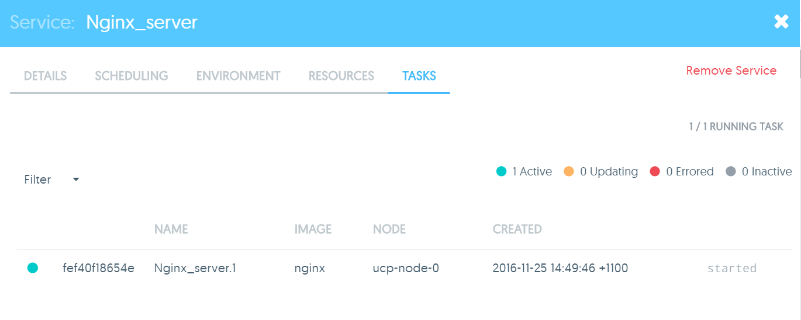

# Task - Deploy a basic Service

In this task you will learn how to deploy Services in UCP.

## Pre-requisites
1. UCP installed with 2 worker nodes

## Step 1 - Deploy NGINX Service

1. Login to UCP on your web browser. 
2. Click on the **Resources** tab on the top navigation bar. This should take you to the **Services** Page.

   
   
3. Click on the **Create Service** button
4. Enter the following details on the form:

   **Service Name: ** Nginx_server
   
   **Image Name: ** nginx
   
   **Mode: ** replicated
   
   **Scale: ** 1
   
   Leave all other fields as they are.
   
5. On the botton right corner, click on the **Deploy Now** button. This will create the Service. Now click back on the main screen area and you should see the following:

   
   
6. Click on your newly created Service to see it's details. Then click on the **Task** tab. This shows us all the tasks running for that Service and the container corresponding
   to that task. It also shows us what node the task container is running on. At the moment we have the 1 task in our Service and what you should see is something similar 
   to the screen capture below.

   
   
   Look at the **Node** column on your **Task** tab. Take note of which node your NGINX task is running on.

## Step 2 - Publish ports

1. Let's try to accces our NGINX container. Open your browser and put in the IP address or Domain of the node where your NGINX container is running.

   You'll notice that you cannot reach the site. This is because we have not published any of the container ports.
   
2. Click on your **Nginx_server** service again and scroll down to the bottom of the **Details** tab. You should see a section called **Published Ports**.

   
   
3. Click on the link that says **Publish a Port**
4. Specify to publish the container port 80 to the public port of 8080 as shown in the screen below:

   

5. Click **Done**.

   This will trigger a warning message about tasks being restarted.
   
   
   
6. Click on the **Save Changes** button and wait for the update to finish

7. Check the **Task** tab of your service again and check which node the container is now running on. 

   The reason we are checking again is because when we published our ports, this triggered a restart of the Service tasks. Swarm shuts down the existing task that was 
   running the NGINX container and starts a new tasks to replace it. This new task may not necessarily be scheduled on the same node. 
   
8. Access your NGINX server on your web browser. You should now see the welcome page.

   Input the the domain of the node your task is running on and specify port 8080.
   
   
   
   